# 2209106031 - Salwa Arlinda Humairah

# Posttest 1
### 1. Landing Page (Home)

### 2. Halaman About

### 3. Halaman Product

# Posttest 2
### 1. Database
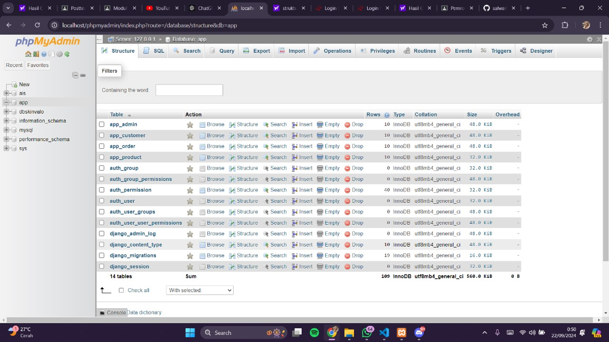

### 2. Structure table admin
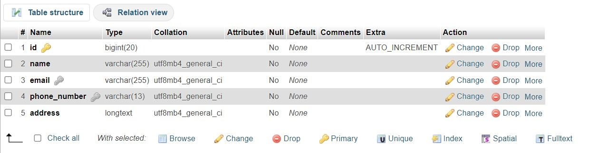

### 3. Isi table admin
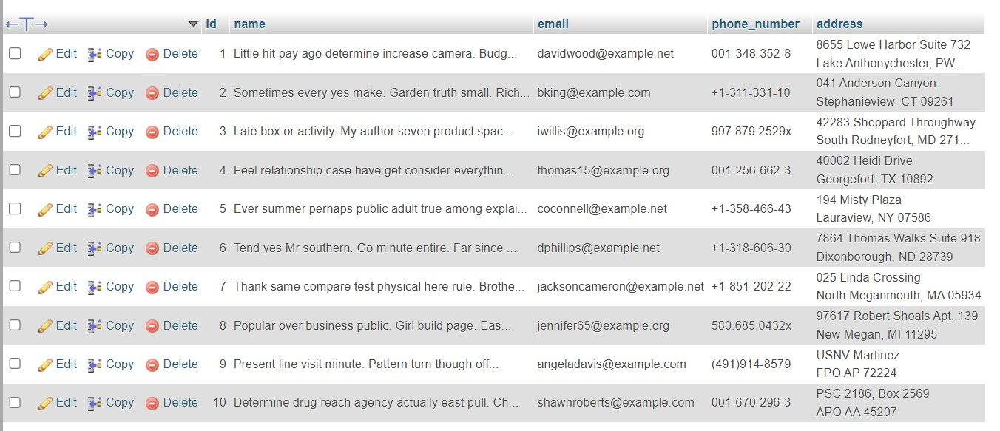

### 4. Structure table customer

### 5. Isi table customer
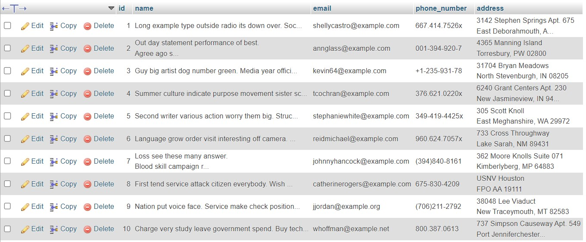

### 6. Structure table order
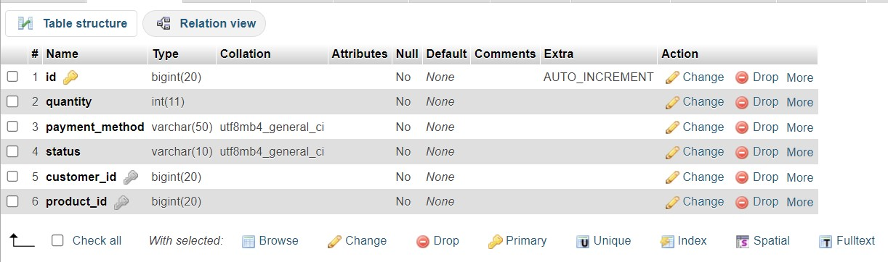

### 7. Isi table order
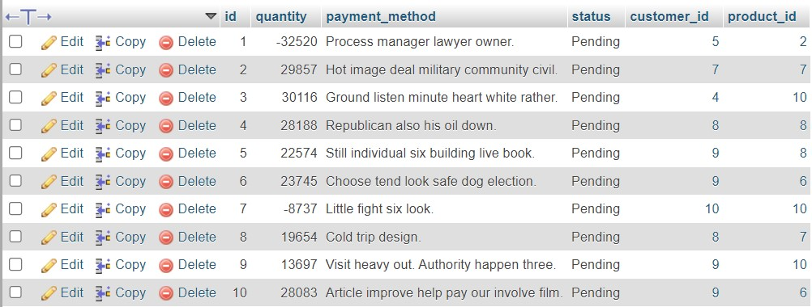

### 8. Structure table product
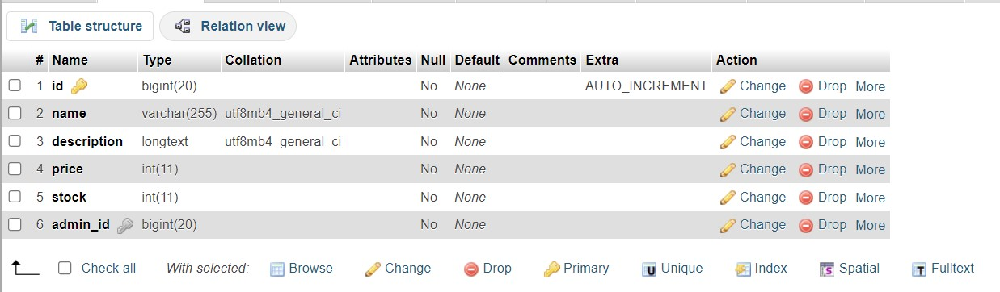

### 9. Isi table product
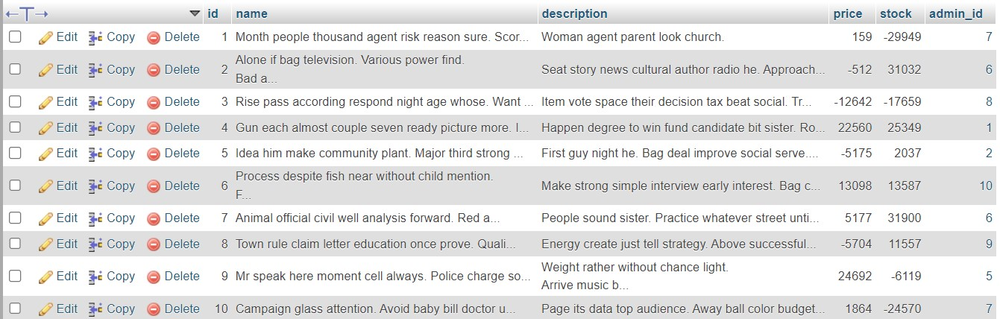

### 10. Structure table users
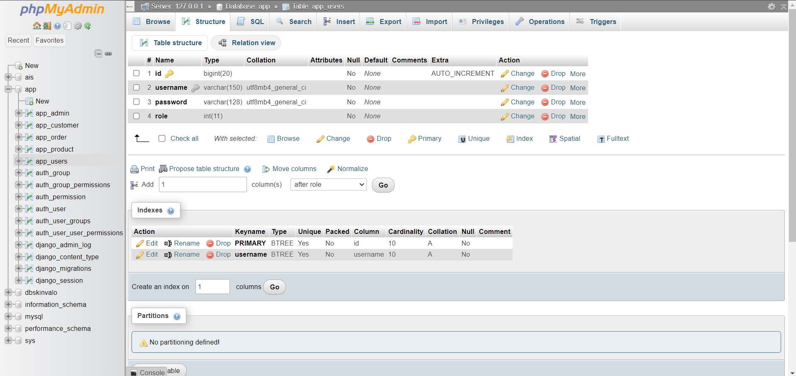

### 11. Isi table users
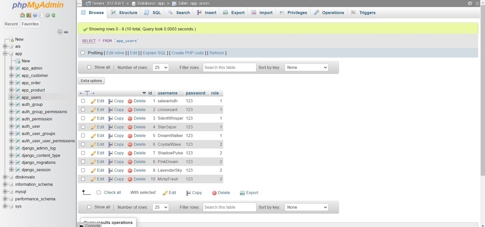

# Posttest 3
### 1. Form Admin
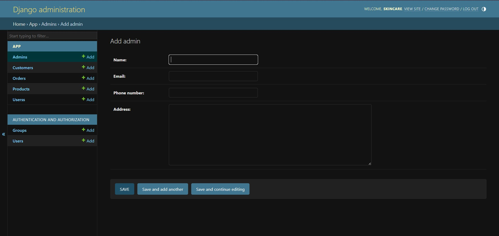

### 2. Tabel Admin
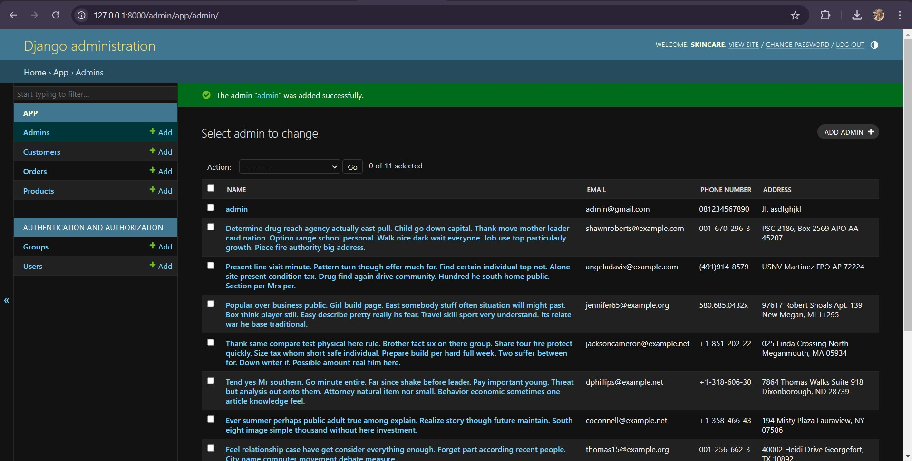

### 3. Form Customer
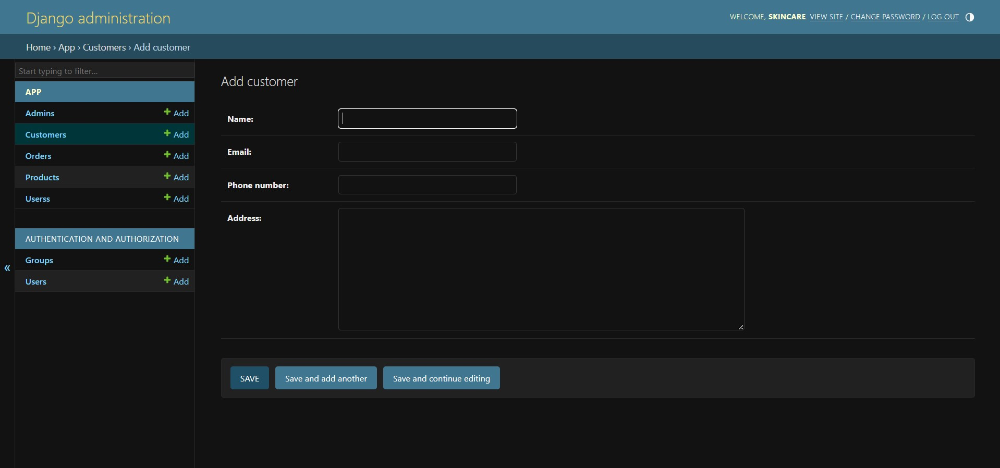

### 4. Tabel Customer
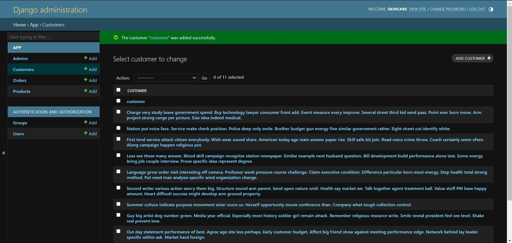

### 5. Form Order
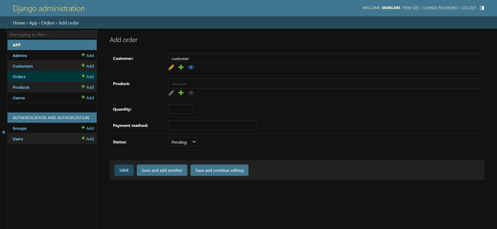

### 6. Tabel Order
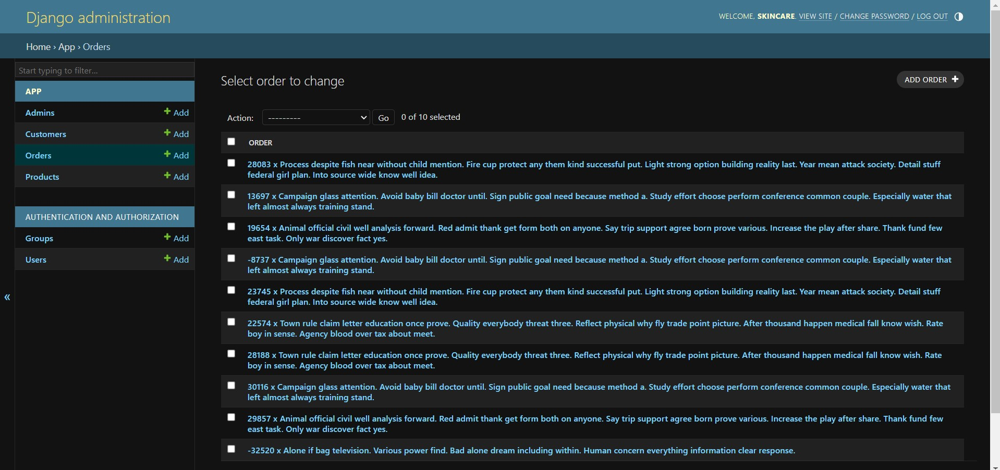

### 7. Form Product
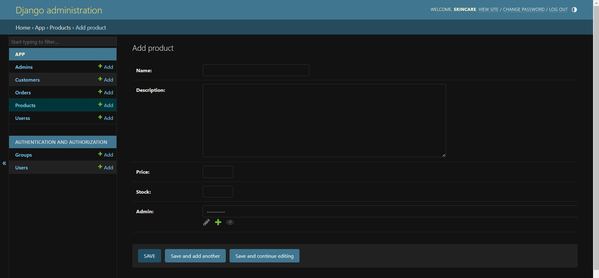

### 8. Tabel Product
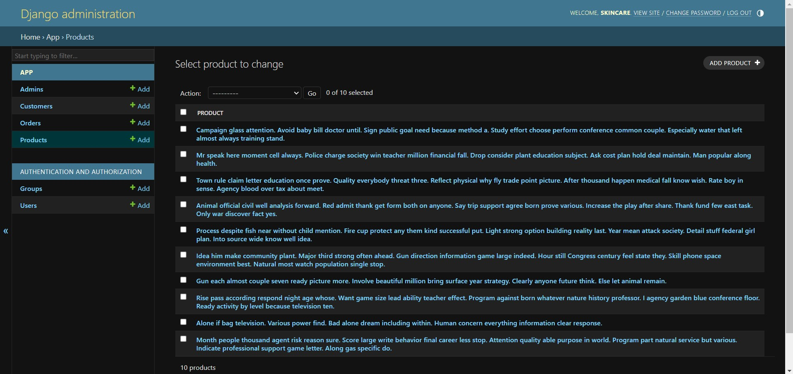

### 9. Form Users
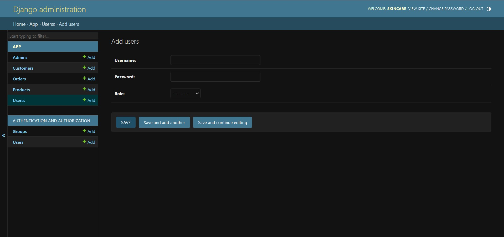

### 10. Tabel Users
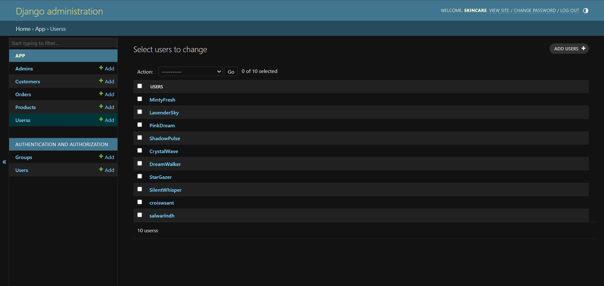

## Function
### Function yang digunakan untuk memastikan bahwa setiap kali objek disimpan, 
### kode memastikan bahwa pengguna terkait juga dibuat jika belum ada, 
### atau diperbarui jika sudah ada, sehingga data antara objek tersebut dan pengguna di dalam sistem tetap konsisten.

## Static
### img/logo.png | layout.html
### img.moist.jpg | product.html
### img.foto.jpg | product.html
### img.foto2.jpg | product.html
### img.foto3.jpg | product.html

# Posttest 4

### 1. Create 

### 2. Read 

### 3. Read data di User

### 4. Update

### 5. Delete

